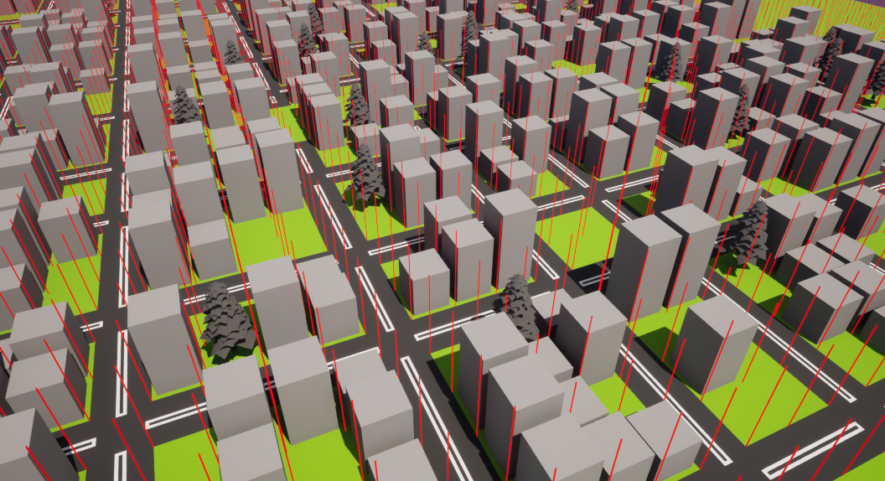

# Instalation

To install this shit, you need to setup yout git repository correctly

Firstly download Git LFS here -> https://git-lfs.com

## Manual installation

1. Navigate to your Unreal project folder
E. g.:
```console
cd C:\Users\USERNAME\Documents\Unreal Projects\FussyFox
```
2. Setup your git repository folder
```console
git init
git lfs install
```
3. Add Large file storage tracking
```Console
git lfs track "Content/Assets**"
git lfs track "Content/Maps**"
git lfs track "Content/__ExternalActors__**"
git lfs track "Content/__ExternalObjects__**"
git checkout -b main
git pull https://github.com/YevhenHoina/FussyFox main
git pull lfs https://github.com/YevhenHoina/FussyFox main
```

## Auto instalation
```console
git clone https://github.com/YevhenHoina/FussyFox FussyFox
```

## Project terminology

### Tick Tack
Tick Tack (тік так) - road which begins with road_end and ends with road_end and doest contain any crossings
